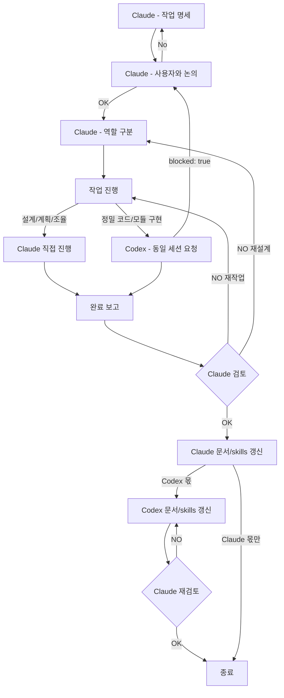

# Claude–Codex Supervisor–Worker 워크플로우

이 구조는 사용자가 주요 의사결정을 승인하는 **Human-in-the-loop 다중 에이전트 오케스트레이션**이며, Claude가 작업 명세·역할 배정·검수를 담당하고 Codex가 정밀 구현을 담당하는 **Supervisor–Worker 아키텍처**이다.

```mermaid
graph TD
    A[Claude - 작업 명세] --> B[Claude - 사용자와 논의]
    B -- No --> A
    B -- OK --> C[Claude - 역할 구분]

    C --> D[작업 진행]

    D -- 설계/계획/조율 --> E[Claude 직접 진행]
    D -- 정밀 코드/모듈 구현 --> F[Codex - 동일 세션 요청]

    E --> H[완료 보고]
    F --> H
    F -- "blocked: true" --> B

    H --> I{Claude 검토}

    I -- NO 재작업 --> D
    I -- NO 재설계 --> C
    I -- OK --> K[Claude 문서/skills 갱신]

    K -- Codex 몫 --> L[Codex 문서/skills 갱신]
    L --> J{Claude 재검토}
    J -- NO --> L
    J -- OK --> M[종료]

    K -- Claude 몫만 --> M
```
